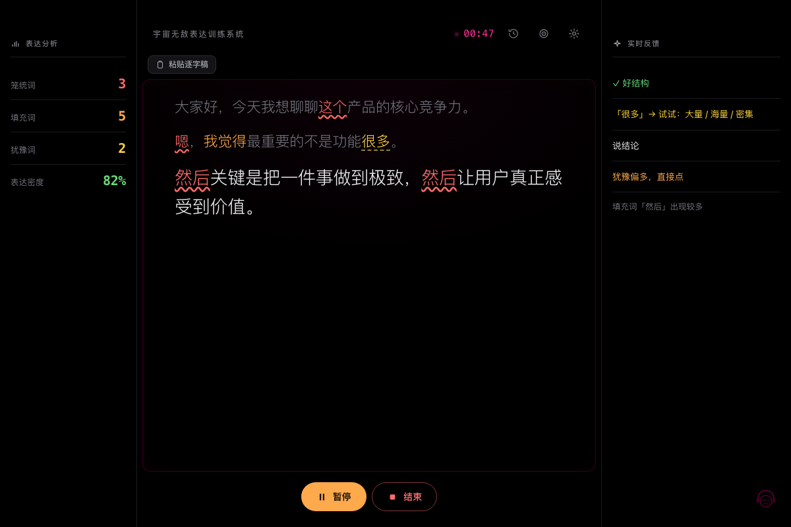
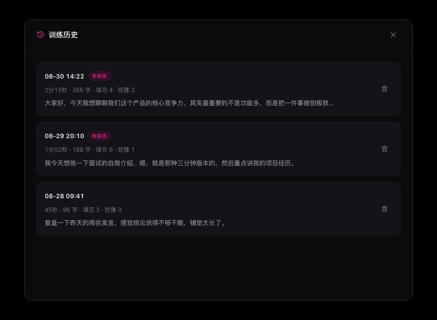
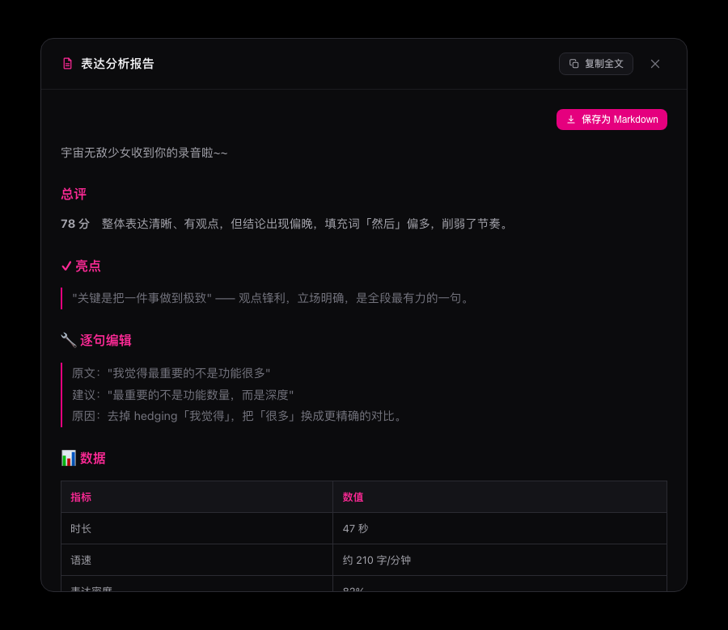

# 🚀 Expression Trainer — Local Desktop App

[中文](README.md) · **English**

A local desktop app that helps you train the precision of your spoken expression: real-time speech recognition → lexicon matching → AI feedback. Speech recognition and lexicon analysis run fully offline/on-device; AI feedback is called on demand over the network.

The desktop app has migrated from Electron to **Tauri v2** (Rust backend + system WebView) — smaller installer, faster startup, and a **built-in speech model** so it works out of the box.

## Screenshots

**Live training** — full-screen subtitles with word-class highlighting (🔴 fillers / 🟠 hedges / 🟡 vague words), live stats on the left, real-time AI feedback on the right.



| Training history | Analysis report |
|---|---|
|  |  |

## ⬇️ Download (recommended)

Grab the latest `.dmg` from **[Releases](https://github.com/wangsoft/expression-trainer/releases/latest)**:

- For **macOS 11+ / Apple Silicon (arm64)**
- **Built-in int8 speech model — no extra download**, works immediately
- Open the `.dmg` → drag the app into `Applications`
- ⚠️ **Important**: the app is unsigned/unnotarized. A `.dmg` downloaded from the internet is quarantined by macOS, so double-clicking usually shows **“app is damaged and can’t be opened”**. After installing, run this **once** in Terminal and it will work:
  ```bash
  xattr -cr "/Applications/宇宙无敌表达训练.app"
  ```
  (Then just double-click to open; on first launch you can also try right-click → “Open”.)

> For other platforms/architectures (Intel Mac, Windows, Linux), [build from source](#build-from-source).

## Features

- 🎙️ **Real-time speech recognition** — powered by [Sherpa-ONNX](https://github.com/k2-fsa/sherpa-onnx) streaming paraformer (Chinese + English), fully offline
- 🖥️ **Full-screen subtitles** — large text on black, showing every sentence in real time
- 🔍 **Lexicon analysis** — auto-detects fillers, hedges, and vague words, with precise alternatives
- 🤖 **AI feedback** — supports OpenAI / DeepSeek / Ollama / any custom OpenAI-compatible endpoint
- 📊 **Analysis report** — multi-dimensional deep review (logic / directness / fillers / density / vocabulary / highlights)
- 🕘 **Training history** — every session auto-saved (transcript + stats + report); browse, re-read, delete
- 📋 **Transcript mode** — paste existing text and analyze it directly, no recording needed

## How to use

1. **Click “Start recording”** → grant microphone permission on first run, then speak
2. **Live subtitles** appear in the center with word classes highlighted
3. **Left panel** shows live counts of fillers / hedges / vague words / expression density
4. **Right panel** gives real-time AI feedback (requires an LLM API key in Settings)
5. **Click “Stop”** when done → click “Generate report” for the full analysis
6. Click the 🕘 **history** icon in the top bar to review past sessions

### Configure the AI backend

Open Settings via the gear icon in the top-right:

| Backend | Cost | Speed | Where to get a key |
|------|------|------|----------|
| DeepSeek (recommended) | very low | fast | [platform.deepseek.com](https://platform.deepseek.com) |
| OpenAI | medium | fast | [platform.openai.com](https://platform.openai.com) |
| Ollama | free | depends on hardware | [ollama.com](https://ollama.com) (local) |
| Custom | varies | — | any OpenAI-compatible Base URL |

**DeepSeek is recommended**: high-quality reports at very low cost.

## Subtitle color legend

| Color | Meaning |
|------|------|
| 🔴 red wavy underline | filler words (um, uh, "then", "that"…) |
| 🟠 orange | hedge words ("maybe", "I think", "probably"…) |
| 🟡 yellow dashed | vague words (with precise alternatives) |
| 🟢 green | strong expression (nice sentence!) |

## Build from source

Requires **Node.js 20+**, **Rust** (stable), and **Xcode Command Line Tools**.

```bash
# 1) Install frontend deps + Tauri CLI
npm install

# 2) Download the speech model into models/ (bundled at build time, also used by dev)
cd models
wget https://github.com/k2-fsa/sherpa-onnx/releases/download/asr-models/sherpa-onnx-streaming-paraformer-bilingual-zh-en.tar.bz2
tar xvf sherpa-onnx-streaming-paraformer-bilingual-zh-en.tar.bz2
cd ..

# 3) Dev mode (hot reload)
npm run tauri:dev

# 4) Build the .dmg (with the int8 model bundled)
npm run tauri:build
# output under src-tauri/target/release/bundle/
```

After extraction, `models/` should contain (only the int8 variant is used):

```
models/
└── sherpa-onnx-streaming-paraformer-bilingual-zh-en/
    ├── encoder.int8.onnx
    ├── decoder.int8.onnx
    └── tokens.txt
```

> ⚠️ When launched via `npm run tauri:dev` from a terminal, the microphone may be blocked by macOS TCC responsible-process attribution (error “not allowed by the user agent”). **To verify the microphone, use the packaged `.app`** — it has its own app identity and gets permission normally.

## Architecture

```
┌──────────────────────────────────────────────────┐
│ Tauri v2 backend (Rust, statically linked sherpa)  │
│  ├── asr.rs      streaming ASR (OnlineRecognizer)   │
│  ├── lexicon.rs  lexicon matching (emotion-lexicon) │
│  ├── llm.rs      AI feedback (reqwest, multi-backend)│
│  ├── settings.rs settings persistence               │
│  └── history.rs  training history                   │
├──────────────────────────────────────────────────┤
│ Frontend (system WebView)                          │
│  ├── subtitles / live stats / feedback panel       │
│  ├── report & history modals                       │
│  └── api-shim.js (window.api → Tauri invoke)       │
└──────────────────────────────────────────────────┘
```

Speech recognition uses the official [`sherpa-onnx`](https://crates.io/crates/sherpa-onnx) Rust crate, statically linked into the binary — no shipped dynamic libraries.

## About the lexicon

`data/emotion-lexicon.json` is based on the 7-category structure of the Dalian University of Technology emotion lexicon, and includes:

- **130+ emotion words** — category (joy/anger/sorrow/fear/disgust/surprise) + intensity (1–9)
- **Vague → precise mapping** — 25 groups of high-frequency alternatives
- **Filler list** — 24 common verbal tics
- **Hedge list** — 19 weakening expressions
- **Intensity gradient** — weak → medium → strong → extreme
- **Vividness** — 10 “abstract → concrete” transformations
- **Hedge → direct** — 8 before/after pairs

## Project structure

```
├── src/                    # Frontend (HTML/CSS/JS)
│   ├── index.html          # main window
│   ├── api-shim.js         # window.api → Tauri invoke bridge
│   ├── app.js  styles.css  # frontend logic / styles
│   ├── settings.html/.js   # settings page
│   └── prompt-editor.html  # training-rule editor
├── src-tauri/              # Tauri v2 + Rust backend
│   ├── src/                # asr / llm / lexicon / prompts / settings / history / lib
│   ├── tauri.conf.json     # app config (bundled model, windows, etc.)
│   ├── Cargo.toml
│   └── icons/              # app icons
├── data/emotion-lexicon.json
├── models/                 # sherpa-onnx int8 model (bundled in releases; download for source builds)
└── main.js  preload.js  lib/   # legacy Electron version (kept, not the main path)
```

## Requirements

- **Release dmg**: macOS 11+, Apple Silicon (arm64)
- **Build from source**: Node.js 20+, Rust (stable), Xcode Command Line Tools
- Microphone permission
- (Optional) network — only for AI feedback; speech recognition and lexicon analysis work offline

## License

MIT
